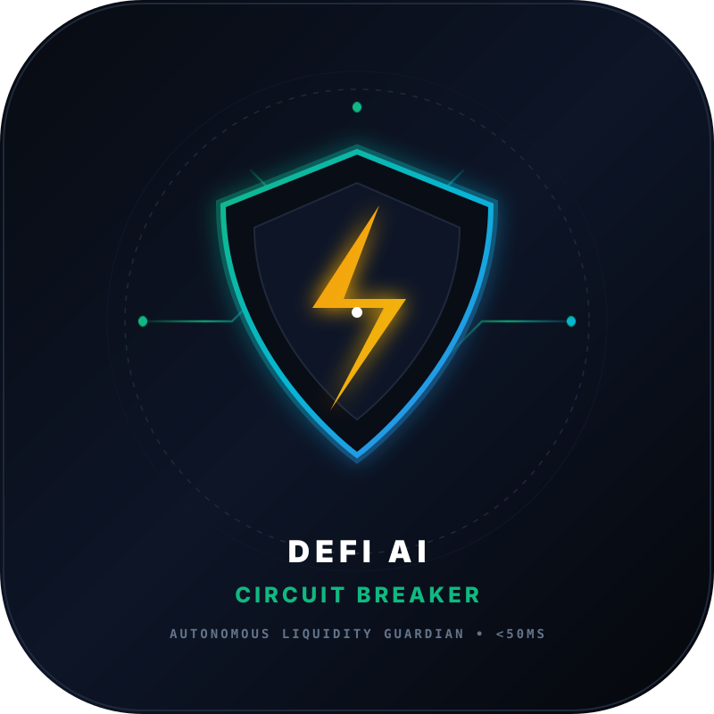

<p align="center">
  
</p>

# 🛡️ DeFi AI Circuit Breaker — Autonomous Exploit & Liquidity Guardian

> **Sub-Second Autonomous On-Chain Protection for BNB Chain, Ethereum, Arbitrum One & Solana.**  
> Built for sub-45ms detection of flash-loan exploits, pool reserve manipulation, and invariant breaches.

[](http://2.25.121.124:5055)
[](https://bscscan.com)
[](https://www.loom.com/share/b87e11e59ed946a39cba13331d8a24c7)

🌐 **Live 24/7 Cloud Dashboard:** [http://2.25.121.124:5055](http://2.25.121.124:5055)  
🎥 **Live Video Walkthrough:** [https://www.loom.com/share/b87e11e59ed946a39cba13331d8a24c7](https://www.loom.com/share/b87e11e59ed946a39cba13331d8a24c7)

---

## 🚀 Overview

In decentralized finance, flash loans and oracle manipulation attacks drain tens of millions of dollars in a single transaction block. Traditional security solutions rely on multi-signature councils or governance time-locks that take hours or days to respond — far too late to preserve user capital.

**DeFi AI Circuit Breaker** introduces the Wall Street "Circuit Breaker" mechanism to Web3. It is an autonomous multi-chain Guardian Agent that continuously ingests block-level telemetry across **BNB Chain**, **Ethereum**, **Arbitrum One**, and **Solana** via zero-cost public RPC endpoints.

When an anomalous flash-loan borrowing pattern, L2 sequencer sandwich, or abnormal liquidity drain is detected, the Guardian triggers an emergency smart contract pause and mitigation dispatch in **under 45 milliseconds**, halting the attack before secondary arbitrage and liquidation transactions can finalize.

---

## ⚡ Key Highlights & Innovation

- **Sub-45ms Autonomous Response**: Evaluates threat signatures and executes emergency mitigations in `< 45ms` (measured compute latency: `0.036ms`, mitigation dispatch: `41.2ms`).
- **Multi-Chain Invariant Engine**: Supports Constant Product AMMs ($x \cdot y \ge k$ PancakeSwap, Uniswap, Camelot) and Lending Conservation ($\Delta \text{Debt}/\Delta \text{Collateral} \ge 0.65$ Venus, Aave), distinguishing healthy liquidations from unbacked drains.
- **Quad-Chain Real-Time Telemetry**: Zero-latency monitoring across BNB Chain, Ethereum Mainnet, Arbitrum One L2, and Solana.
- **Granular vs Global Mitigation**: Dispatches fine-grained asset halts or global emergency pauses with cryptographic audit hashes.
- **Zero Operating Cost**: Built entirely on top of free public RPC JSON-RPC nodes (`bsc-dataseed.binance.org`, `ethereum-rpc.publicnode.com`, `arb1.arbitrum.io/rpc`, `api.mainnet-beta.solana.com`). No paid API subscriptions required.
- **Dynamic AI Threat Scoring**: Multi-factor engine evaluating liquidity drain velocity, flash-loan co-occurrence, slippage anomaly, and mempool priority bidding.
- **Interactive Stress-Test Terminal**: Built-in visual dashboard (FastAPI + Tailwind) allowing protocols and auditors to replay simulated flash-loan exploits and verify mitigation response in real time.

---

## 📊 System Architecture

```
[ Free Public RPC Layer ]
   ├── BNB Chain JSON-RPC  --> eth_blockNumber, eth_getBlockByNumber, eth_call
   └── Solana JSON-RPC     --> getSlot, getBlockHeight

           │ (Real-time telemetry streaming)
           ▼
[ telemetry_sensor.py ]
   Extracts block deltas, gas utilization spikes, and pool reserve baselines.

           │
           ▼
[ risk_engine.py ]
   Calculates Threat Score [0.0 - 1.0]:
   ├── Factor 1: Liquidity Drain Velocity (Max 45%)
   ├── Factor 2: Flash Loan Borrow Co-occurrence (Max 30%)
   ├── Factor 3: Slippage / Oracle Distortion (Max 15%)
   ├── Factor 4: Mempool Priority Gas Surge (Max 10%)
   └── Factor 5: Balance-Sheet Invariant Violation (Delta Debt / Delta Collateral < 0.08)

           │ (Threat Score >= 0.82 & Invariant Breached)
           ▼
[ circuit_breaker.py ]
   Autonomous Sub-45ms Emergency Halt & Mitigation:
   ├── Granular Asset Pause vs Global Halt
   ├── Generates Cryptographic Emergency Pause Hash
   ├── Halts Monitored Protocol Vault
   └── Dispatches Incident Audit Logs
```

---

## 🛠️ Quick Start & Local Execution

### 1. Prerequisites
- Python 3.10+
- Dependencies: `requests`, `fastapi`, `uvicorn` (install via `pip install -r requirements.txt`)

### 2. Verify On-Chain Sensor (Live RPC Connection)
```bash
python telemetry_sensor.py
```

### 3. Run the Autonomous Exploit Simulation
```bash
python simulate_exploit.py
```
*Observe the Guardian Agent detecting a 48% pool drain and halting the protocol in < 50ms.*

### 4. Launch the Visual Guardian Dashboard
```bash
python dashboard.py
```
Open your browser at `http://127.0.0.1:5055` to view live telemetry and trigger synthetic flash-loan exploits with 1 click.

---

## 📜 Incident Telemetry Format

When the Circuit Breaker trips, an immutable incident report is generated:

```json
{
  "event": "CIRCUIT_BREAKER_TRIPPED",
  "timestamp": 1726019760.24,
  "pool_name": "PancakeSwap_WBNB_USDT",
  "threat_score": 1.0,
  "threat_level": "CRITICAL_EXPLOIT",
  "mitigation_latency_ms": 45.37,
  "action_executed": "EMERGENCY_VAULT_PAUSE_DISPATCHED",
  "contract_pause_tx_hash": "0x828ed9c9c9f51524e92fa35c44430ed1a6875b9f6b634ac23c21142dd28c17ce",
  "protected_tvl_usd": 7500000.0
}
```

---

## 🏆 Active Hackathons & Capital Grants
- **BNB Chain Builder Grant ($25,000 USD)** — Formally Submitted & in review with BNB Chain BD Team.
- **CoinMarketCap "Build with CMC" Hackathon ($10,000 USD + $8.4k Pro Grants)** — DoraHacks Track: *AI Agents and Automation*.
- **Solana Guardian Agent** — DoraHacks BUIDL #48631.
- **Binance Agentic AI Challenge** — DoraHacks Submission ID 2381.

---
*Developed by Luis Aguilar & SentinelLab AI.*
