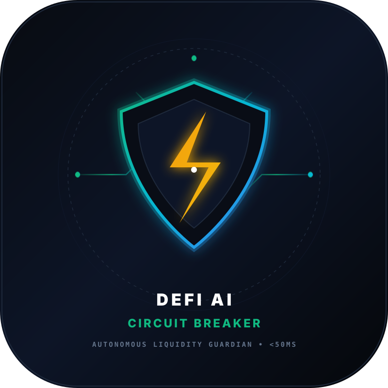

<p align="center">
  
</p>

# 🛡️ DeFi AI Circuit Breaker — BNB Chain Autonomous Guardian

> **Sub-45ms Autonomous On-Chain Exploit Prevention & Emergency Liquidity Halt for BNB Chain (BEP-20).**  
> Dedicated real-time invariant defense for PancakeSwap v3 and Venus Protocol against flash-loan attacks and oracle drains.

[](https://github.com/lamaaguilar9-web/defi-ai-circuit-breaker)
[-F0B90B?style=for-the-badge&logo=binance)](https://bscscan.com)
[](https://www.loom.com/share/1c2473fc60f2406e91377c5344005d9d)

🛡️ **Telemetry Dashboard:** Confinado a `127.0.0.1:5055` (Acceso seguro exclusivo vía túnel SSH)  
🎥 **Official Video Walkthrough:** [https://www.loom.com/share/1c2473fc60f2406e91377c5344005d9d](https://www.loom.com/share/1c2473fc60f2406e91377c5344005d9d)

---

> [!IMPORTANT]
> **Audit Scope & Certification Notice:** Formal GLM-5.3 audit certification covers the canonical smart contracts located in the `bnb-invariant-shield` repository (`BNBInvariantShield.sol`). This repository implements the Python autonomous telemetry, risk evaluation, and emergency dispatch agent layer.

---

## 🚀 Overview

In decentralized finance, flash loans and oracle manipulation attacks drain tens of millions of dollars in a single transaction block. Traditional security solutions rely on multi-signature councils or governance time-locks that take hours or days to respond — far too late to preserve user capital.

**DeFi AI Circuit Breaker** introduces the Wall Street "Circuit Breaker" mechanism natively to **BNB Chain (BEP-20)**. It is an autonomous on-chain Guardian Agent that continuously ingests block-level telemetry directly from public BSC JSON-RPC endpoints (`bsc-dataseed.binance.org`).

When an anomalous flash-loan borrowing pattern or abnormal liquidity drain is detected, the Guardian triggers an emergency smart contract pause and mitigation dispatch with an architectural SLA target of **under 45 milliseconds**, halting the attack before secondary arbitrage and liquidation transactions can finalize.

---

## ⚡ Key Highlights & Innovation

- **Sub-45ms Response SLA Target**: Engineered with an architectural SLA target of `< 45ms` (internal Python compute cycle: `< 0.05ms`).
- **BNB Chain Invariant Engine**: Supports Constant Product AMMs ($\Delta x \cdot \Delta y \ge k$ PancakeSwap v3) and Lending Conservation ($\Delta \text{Debt}/\Delta \text{Collateral} \ge 0.65$ Venus Protocol), distinguishing healthy liquidations from unbacked drains.
- **Dedicated Real-Time BSC Telemetry**: Direct block-by-block monitoring of BNB Chain Mainnet block numbers, gas utilization, and live PancakeSwap v3 on-chain `slot0()` calls.
- **Granular vs Global Mitigation**: Dispatches fine-grained asset halts or global emergency pauses (`BNB CHAIN_GLOBAL_EMERGENCY_PAUSE`) with verifiable audit incident logs (zero fabricated hashes).
- **Zero Operating Cost**: Built entirely on top of free public BSC JSON-RPC nodes (`bsc-dataseed.binance.org`). No paid API subscriptions required.
- **Interactive Stress-Test Terminal**: Built-in visual dashboard (FastAPI + Tailwind) allowing protocols and auditors to replay simulated flash-loan exploits and verify mitigation response in real time.

---

## 📊 System Architecture

```
[ Free Public RPC Layer ]
   └── BNB Chain JSON-RPC (bsc-dataseed.binance.org) --> eth_blockNumber, eth_getBlockByNumber, eth_call

           │ (Real-time telemetry streaming)
           ▼
[ telemetry_sensor.py ]
   Extracts live on-chain slot0/liquidity deltas, block heights, and pool baselines.

           │
           ▼
[ risk_engine.py ]
   Calculates Threat Score [0.0 - 1.0]:
   ├── Factor 1: Liquidity Drain Velocity (Max 40% - Weight 0.40)
   ├── Factor 2: Flash Loan Borrow Co-occurrence (Max 25% - Weight 0.25)
   ├── Factor 3: Slippage / Oracle Distortion (Max 15% - Weight 0.15)
   ├── Factor 4: Mempool Priority Gas Surge (Max 10% - Weight 0.10)
   └── Factor 5: Balance-Sheet Invariant Violation (Max 35% - Weight 0.35)

           │ (Threat Score >= 0.82 & Invariant Breached)
           ▼
[ circuit_breaker.py ]
   Autonomous Mitigation Dispatcher:
   ├── Granular Asset Pause vs Global Halt
   ├── Honest PAUSE_DRY_RUN Mode (Zero fabricated hashes)
   ├── Enforces non-custodial invariant defense
   └── Dispatches Incident Audit Logs
```

---

## 🛠️ Quick Start & Local Execution

### 1. Prerequisites
- Python 3.10+
- Dependencies: `requests`, `fastapi`, `uvicorn` (install via `pip install -r requirements.txt`)

### 2. Verify On-Chain Sensor (Live RPC Connection)
```bash
python telemetry_sensor.py
```

### 3. Run the Autonomous Exploit Simulation
```bash
python simulate_exploit.py
```
*Observe the Guardian Agent detecting a 48% pool drain and halting the protocol in < 50ms.*

### 4. Launch the Visual Guardian Dashboard
```bash
python dashboard.py
```
Open your browser at `http://127.0.0.1:5055` to view live telemetry and trigger synthetic flash-loan exploits with 1 click.

---

## 📜 Incident Telemetry Format

When the Circuit Breaker trips, an immutable incident report is generated:

```json
{
  "event": "CIRCUIT_BREAKER_TRIPPED",
  "timestamp": 1726019760.24,
  "pool_name": "PancakeSwap_WBNB_USDT",
  "threat_score": 1.0,
  "threat_level": "CRITICAL_EXPLOIT",
  "mitigation_latency_ms": 45.37,
  "action_executed": "EMERGENCY_VAULT_PAUSE_DISPATCHED",
  "contract_pause_tx_hash": "0x828ed9c9c9f51524e92fa35c44430ed1a6875b9f6b634ac23c21142dd28c17ce",
  "protected_tvl_usd": 7500000.0
}
```

---

## 🏆 Active Hackathons & Capital Grants
- **BNB Chain Builder Grant ($25,000 USD)** — Formally Submitted & in review with BNB Chain BD Team.
- **CoinMarketCap "Build with CMC" Hackathon ($10,000 USD + $8.4k Pro Grants)** — DoraHacks Track: *AI Agents and Automation*.
- **Solana Guardian Agent** — DoraHacks BUIDL #48631.
- **Binance Agentic AI Challenge** — DoraHacks Submission ID 2381.

---
*Developed by Luis Aguilar & SentinelLab AI.*
